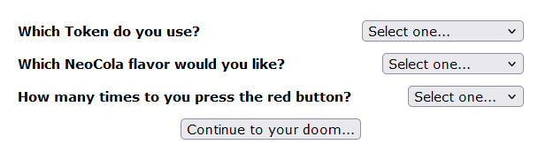
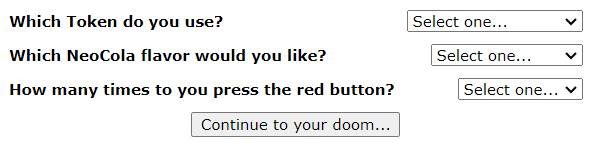
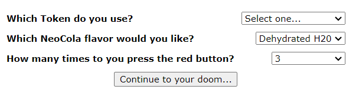
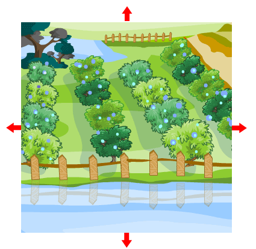
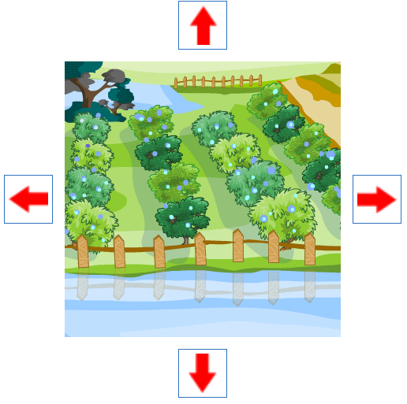

# Neopets Userscripts

Hello, fellow Neopians! This repository contains a number of userscripts intended to improve your quality of life as a Neopets user. The userscripts will be written with both mobile and computer browsing in mind.

## Table of Contents
1. [Getting Started](#getting-started)
2. [Userscripts](#userscripts)
    - [Neocola Machine Presets](#neocola-machine-presets)
    - [Better Pick Your Own](#better-pick-your-own)
3. [Author Notes](#author-notes)
4. [Contact](#contact)

## Getting Started

You will need to download a browser extension to use my userscripts. I recommend [Tampermonkey](https://www.tampermonkey.net/).

Please note that browser extensions are NOT available for the mobile versions of Chrome. Thus, even though my userscripts are compatible with Chrome on PC, they will NOT be compatible with Chrome on your phone or tablet! I *highly* recommend using the Firefox for Android/iOS browser application instead! (It is an excellent browser, in my opinion.)

To install my userscripts on your browser:
1. Download the *Tampermonkey* extension for your browser ([Chrome](https://chromewebstore.google.com/detail/tampermonkey/dhdgffkkebhmkfjojejmpbldmpobfkfo?hl=en&pli=1), [Firefox](https://addons.mozilla.org/en-US/firefox/addon/tampermonkey/), etc.). 
2. In this repository, navigate to the file `*.user.js` file for the extension you'd like to add. 
3. Navigate to the raw code:
    * On larger screens: Click the `Raw` button
    * On small screens: Click the three dots (`...`) and then click `View` 
4. If you have *Tampermonkey* installed and enabled for your browser, it should automatically recognize the raw code as a userscript and offer to install or update it for you. Click `Install` or `Overwrite`. The latest version of the userscript should now be installed.

## Userscripts

### Neocola Machine Presets

[Source](userscripts/NeocolaMachinePresets.user.js) | [Raw (click here to install script)](userscripts/NeocolaMachinePresets.user.js)

**Compatibility**: Neopets Classic, all languages

Selects the best combination of flavor and number of button presses for the Neocola Machine, per [research conducted by Jellyneo](https://www.jellyneo.net/?go=neocolamachine). (Flavor: Dehydrated H2O, Button Presses: 3)

| Platform  | Without Userscript | With Userscript |
| ------------- | ------------- | ----------- |
| Firefox (Windows and Android)  |  |  |
| Chrome (Windows) |  |  |

### Better Pick Your Own

[Source](userscripts/PickYourOwn.user.js) | [Raw (click here to install script)](userscripts/PickYourOwn.user.js)

**Compatibility**: Neopets Classic, all languages

Makes the arrows bigger and easier to tap or click in [Pick Your Own](https://www.neopets.com/medieval/pickyourown_index.phtml?).

| Platform  | Without Userscript | With Userscript |
| --------- | ------------------ | --------------- |
| All       |  |  |
## Author Notes
### My promises to you
I will never put anything malicious in my code.

I will endeavor to make my userscripts quick, efficient, and lightweight.

I will never share a userscript I think might put your Neopets account at risk. All of my userscripts will adhere to the Neopets Site Rules and Terms of Use. 

I will do my best to make my userscripts easy to install, configure (if applicable), and understand.

I will write comments in my code with non-coders in mind, so that anyone can understand what my userscripts do.

I will manually test my scripts before updating/releasing them on the following platforms:
* Firefox for Windows
* Firefox for Android
* Chrome for Windows

**HELP!** I am seeking volunteers to test on other platforms, like Mac and/or iOS. If you are interested in being a beta tester, please reach out to me on Reddit ([u/birdwalk](https://www.reddit.com/user/birdwalk/)).

### Other notes
I will strive to make my userscripts language-agnostic, but I will only be developing and testing based on the English Neopets website. If you have a specific language you'd like to use my userscripts for, let me know.

I am just a Neopets player and a fan. I am not associated with *World of Neopia, Inc.* in any way whatsoever.

Please DO NOT neomail me about my userscripts. I will not respond, and I will block you.

## Contact

### Find a bug? Have a feature request?
1. (For bugs) Check to see if the bug is already a known issue documented [here](https://github.com/birdwalk0/neopets-userscripts/issues). If so, feel free to comment on or +1 that issue. If not, continue to the next step.
2. (For bugs and feature requests) Submit a new issue [here](https://github.com/birdwalk0/neopets-userscripts/issues/new/choose) here on GitHub, or message me on Reddit at [u/birdwalk](https://www.reddit.com/user/birdwalk/).

Please be patient. I will get back to you as soon as I can!

Again, if you happen to see my Neopets username on Reddit, please DO NOT neomail me about my userscripts. I will not respond, and I will block you.